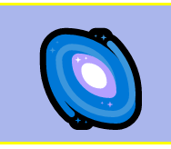
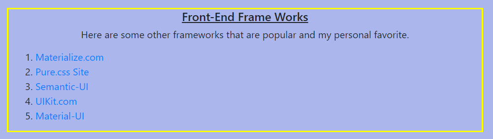
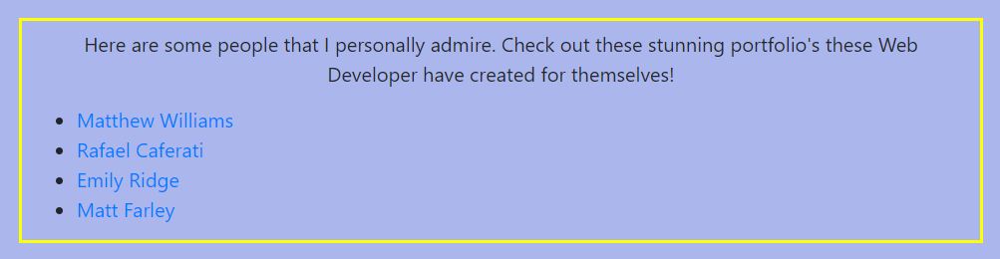
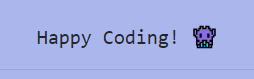

# htmlcss3 
```
- In this project I found my FAVORITE EMOJI EVER! 
- I'm a BIG SPACE GUY!!
```



## This is my First HTML blog!


> The article goes into a brief example of what Bootstrap is by using the actual blog itself as the example. 

> In this blog I talk about what bootstrap is and some other UI frameworks that are good for beginners to Jr. level developers.



## My Mentors

> In this blog I also go over some of my mentors that I look too for inspiration within my own work.



```
Thank you for visiting my first ever HTML Blog
Please check out more of my Github Repo's
Feel free to email me at Nicholas.dallas0@gmail.com
```


## LINKS

- [HTML Blog Link] Coming Soon!
- [Github Repo Link](https://github.com/nicholasd-uci/myHTML-blog)

- - -
© 2020 NPRD, Nicholas Paul Ruiz Dallas